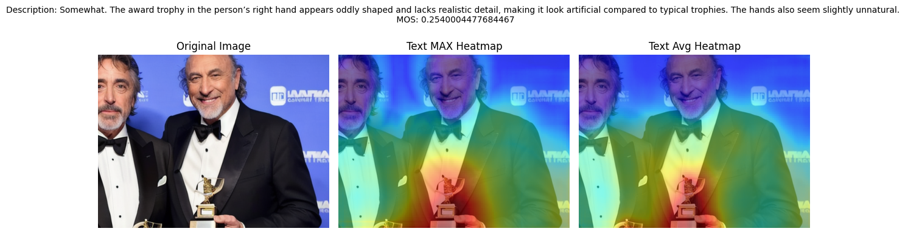

# REALM: REalness Assessment and Localization using Multimodal features

We present REALM, comprehensive framework for analyzing and predicting image realism using multimodal deep learning approaches. This project combines multimodal MOS prediction module (**CORE**) along with a novel approach (**DREAM**) to obtain dense realness mappings to effectively detect unreal patch regions within an image.

## 🎯 Project Overview

### Objectives:
- **Dataset Augmentation**: We augmented existing AIGI datasets with VLM generated natural language descriptions of visual inconsistencies, extractng relevant textual features
- **Objective Realness Assessment**: We designed Cross-modal Objective Realness Estimator (*CORE*) to use both visual and textual feature to effectively quantify perceptual realism of an image
- **Dense Realness Mapping**: We suggest a novel approach to localize unrealistic regions within an image, with pixel-level interpretability

## 🏗️ Project Structure

```
Realness-Project/
├── datasets/                         # Training and test datasets
│   ├── train/                        # Training data
│   │   ├── images/                   # Training images
│   │   └── image_descriptions.csv    # Training annotations
│   └── test/                         # Test data
│       ├── images/                   # Test images
│       └── image_descriptions.csv    # Test annotations
├── regression/                       # MOS prediction model
│   ├── train.py                      # Training script
│   ├── inference.py                  # Inference script
│   ├── realism_dataset.py           # Dataset class
│   ├── regression_model.py          # Model architecture
│   ├── best_model.pth               # Latest best model
│   ├── outputs/                     # Training outputs
│   │   ├── best_model.pth          # Best model checkpoint
│   │   ├── test_predictions.csv    # Model predictions
│   │   └── training_curves.png     # Training visualization
│   └── models/                      # Model checkpoints
├── localization/                     # Unrealism localization
│   ├── desc_generation.py           # Image description generation
│   ├── get_unrealism_heatmaps.py    # Heatmap computation
│   └── run_heatmap_analysis.py      # Analysis pipeline
├── scripts/                         # Shell scripts
│   ├── run_training.sh             # Training launcher
│   ├── run_inference.sh            # Inference launcher
│   └── compute_heatmaps.sh         # Heatmap generator
├── saved_models/                    # Model storage
│   ├── best_model.pth              # Production model
│   └── Model3.pth                  # Backup model
├── doc_images/                      # Documentation assets
│   ├── Localization_results.png    # Sample results
│   ├── output_medain2_MOS.png      # Heatmap visualization
│   └── Annual Report 1st year V1 (1).png # Architecture diagram
├── config.py                        # Configuration settings
├── utils.py                        # Utility functions
├── pyproject.toml                  # Project dependencies
├── requirements.txt                # Python dependencies
└── README.md                       # Documentation
```

## 🚀 How to Use

### Prerequisites

- Python 3.9+
- CUDA-compatible GPU (recommended)
- 8GB+ RAM

### Installation

1. **Clone the repository:**
   ```bash
   git clone <repository-url>
   cd Realness-Project
   ```

2. **Create a virtual environment:**
   ```bash
   python3 -m venv venv
   source venv/bin/activate  # On Windows: venv\Scripts\activate
   ```

3. **Install dependencies:**
   ```bash
   pip install -e .
   ```

### 🏋️ Training the MOS Prediction Model

Run the training script to train the multimodal MOS prediction model:

```bash
./train.sh
```

Or run directly:
```bash
python3 -m regression.train
```

### 🔍 Computing Unrealism Heatmaps

Compute heatmaps to visualize which parts of images appear unrealistic:

```bash
# Process a single image (default: f22.png)
./compute_heatmaps.sh

# Process specific images
./compute_heatmaps.sh f22.png f126.png

# Process all test images
./compute_heatmaps.sh --all

# Process specific image with custom parameters
./compute_heatmaps.sh f22.png --window 128 --stride 64
```

## 🧠 Model Architecture

### MOS Prediction Model

Our multimodal approach combines:

- **Visual Features**: ResNet-50 pretrained on ImageNet
  - Extracts 2048-dimensional image features
  - Optional freezing for transfer learning

- **Text Features**: BERT-base-uncased
  - Processes image descriptions
  - Generates 768-dimensional text embeddings

- **Fusion Network**: 
  - Concatenates visual and text features (2816 dimensions)
  - Dense layers with ReLU activation
  - Single output for MOS prediction

.png)

### Compute and Localize Unrealism Heatmaps

Uses CLIP (Contrastive Language-Image Pre-training) for patch-level analysis:

- **Sliding Window**: Processes image patches with configurable window size and stride
- **Text-Image Similarity**: Computes cosine similarity between patch embeddings and text descriptions
- **Heatmap Generation**: Aggregates similarity scores to create spatial heatmaps



## 📈 Performance Metrics

The model is evaluated using:
- **Spearman Correlation**: Measures rank correlation with human judgments
- **Pearson Correlation**: Measures linear correlation
- **Mean Squared Error (MSE)**: Training loss function

## 💻 Usage Examples

### Training with Custom Parameters

```python
from regression.train import main, train_model, load_and_prepare_data, create_data_loaders

# Load data
train_df, val_df, test_df = load_and_prepare_data()

# Create data loaders
train_loader, val_loader, test_loader = create_data_loaders(
    train_df, val_df, test_df, batch_size=32
)

# Train model
model, train_losses, val_losses, best_spearman = train_model(
    train_loader, val_loader, test_loader, 
    num_epochs=20, 
    learning_rate=0.0001
)
```

### Generating Heatmaps Programmatically

```python
from localization.run_heatmap_analysis import process_single_image, load_data
from pathlib import Path

# Load dataset
df = load_data("datasets/test/image_descriptions.csv")

# Process single image
success = process_single_image(
    df=df,
    filename="f22.png",
    images_dir=Path("datasets/test/images"),
    output_dir=Path("localization/heatmaps"),
    window_size=64,
    stride=32
)
```

## 📊 Dataset Format

### CSV Structure
```csv
filename,MOS,description
f22.png,-0.280048,"Somewhat. The hand resting on the shoulder appears oddly shaped..."
f126.png,0.709697,"No, there is nothing unrealistic in this image..."
```

### Data Fields
- **filename**: Image filename (PNG format)
- **MOS**: Mean Opinion Score (continuous value, higher = more realistic)
- **description**: Detailed text description of realism assessment

## 🛠️ Configuration

### Environment Variables

Set in `config.py`:
```python
BASE_DIR = Path(os.getenv("PROJECT_ROOT", Path(__file__).resolve().parent))
```

### Key Parameters

- **Image Size**: 384 × 512 pixels
- **Text Length**: Maximum 128 tokens
- **Batch Size**: 16 (adjustable)
- **Learning Rate**: 0.0001 (default)

## 📋 Requirements

Core dependencies:
- `torch` >= 1.12.0
- `torchvision` >= 0.13.0
- `transformers` >= 4.20.0
- `pandas` >= 1.4.0
- `PIL` (Pillow)
- `matplotlib`
- `scikit-learn`
- `scipy`
- `numpy`


## 📄 Citation

If you use this project in your research, please cite:

```bibtex
@misc{
}
```

## 👥 Authors

- **Dr. Somdyuti Paul** - somdyuti@cai.iitkgp.ac.in
- **Lovish Kaushik** - lovishkaushik.24@kgpian.iitkgp.ac.in  
- **Agnij Biswas** - biswasagnij@kgpian.iitkgp.ac.in

## 📜 License


## 🙏 Acknowledgments


