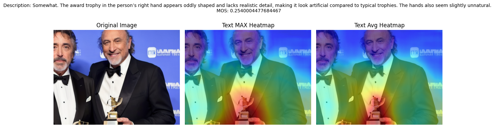

# Realness Project

A comprehensive framework for analyzing and predicting image realism using multimodal deep learning approaches. This project combines computer vision and natural language processing to assess the perceptual realism of images and localize unrealistic regions.

.png)

## 🎯 Project Overview

The Realness Project aims to automatically assess image realism through:
- **Mean Opinion Score (MOS) Prediction**: Predicting how realistic an image appears to human observers
- **Unrealism Localization**: Identifying specific regions in images that appear unrealistic
- **Multimodal Analysis**: Leveraging both visual features and textual descriptions for comprehensive analysis

## 📊 Results

Our model achieves strong performance in predicting human perception of image realism:



## 🏗️ Project Structure

```
Realness-Project/
├── 📁 datasets/               # Training and test datasets
│   ├── train/                 # Training data
│   │   ├── images/           # Training images
│   │   └── image_descriptions.csv
│   └── test/                  # Test data
│       ├── images/           # Test images
│       └── image_descriptions.csv
├── 📁 regression/             # MOS prediction model
│   ├── train.py              # Training script
│   ├── realism_dataset.py    # Dataset class
│   └── regression_model.py   # Model architecture
├── 📁 localization/           # Unrealism localization
│   ├── get_unrealism_heatmaps.py
│   └── run_heatmap_analysis.py
├── 📁 notebooks/             # Jupyter notebooks for experimentation
├── 📁 Images/                # Project documentation images
├── config.py                 # Configuration settings
├── pyproject.toml            # Project dependencies
├── train.sh                  # Training script
└── generate_heatmaps.sh   # Heatmap generation script
```

## 🚀 Quick Start

### Prerequisites

- Python 3.9+
- CUDA-compatible GPU (recommended)
- 8GB+ RAM

### Installation

1. **Clone the repository:**
   ```bash
   git clone <repository-url>
   cd Realness-Project
   ```

2. **Create a virtual environment:**
   ```bash
   python3 -m venv venv
   source venv/bin/activate  # On Windows: venv\Scripts\activate
   ```

3. **Install dependencies:**
   ```bash
   pip install -e .
   ```

### 🏋️ Training the MOS Prediction Model

Run the training script to train the multimodal MOS prediction model:

```bash
./train.sh
```

Or run directly:
```bash
python3 -m regression.train
```

**Training Features:**
- Multimodal architecture combining ResNet-50 and BERT
- Automatic best model saving based on Spearman correlation
- Training curve visualization
- Comprehensive evaluation metrics

### 🔍 Generating Unrealism Heatmaps

Generate heatmaps to visualize which parts of images appear unrealistic:

```bash
# Process a single image (default: f22.png)
./generate_heatmaps.sh

# Process specific images
./generate_heatmaps.sh f22.png f126.png

# Process all test images
./generate_heatmaps.sh --all

# Custom parameters
./generate_heatmaps.sh f22.png --window 128 --stride 64
```

## 🧠 Model Architecture

### MOS Prediction Model

Our multimodal approach combines:

- **Visual Features**: ResNet-50 pretrained on ImageNet
  - Extracts 2048-dimensional image features
  - Optional freezing for transfer learning

- **Text Features**: BERT-base-uncased
  - Processes image descriptions
  - Generates 768-dimensional text embeddings

- **Fusion Network**: 
  - Concatenates visual and text features (2816 dimensions)
  - Dense layers with ReLU activation
  - Single output for MOS prediction

```python
class MOSPredictor(nn.Module):
    def __init__(self, x=529, freeze_cnn=False, freeze_bert=False):
        super(MOSPredictor, self).__init__()
        # ResNet-50 for image features
        self.cnn = models.resnet50(weights=models.ResNet50_Weights.DEFAULT)
        self.cnn.fc = nn.Identity()
        
        # BERT for text features  
        self.bert = BertModel.from_pretrained('bert-base-uncased')
        
        # Fusion + Regression
        self.fc = nn.Sequential(
            nn.Linear(2048 + 768, x),
            nn.ReLU(),
            nn.Linear(x, 1)
        )
```

### Unrealism Localization

Uses CLIP (Contrastive Language-Image Pre-training) for patch-level analysis:

- **Sliding Window**: Processes image patches with configurable window size and stride
- **Text-Image Similarity**: Computes cosine similarity between patch embeddings and text descriptions
- **Heatmap Generation**: Aggregates similarity scores to create spatial heatmaps

## 📈 Performance Metrics

The model is evaluated using:
- **Spearman Correlation**: Measures rank correlation with human judgments
- **Pearson Correlation**: Measures linear correlation
- **Mean Squared Error (MSE)**: Training loss function

## 💻 Usage Examples

### Training with Custom Parameters

```python
from regression.train import main, train_model, load_and_prepare_data, create_data_loaders

# Load data
train_df, val_df, test_df = load_and_prepare_data()

# Create data loaders
train_loader, val_loader, test_loader = create_data_loaders(
    train_df, val_df, test_df, batch_size=32
)

# Train model
model, train_losses, val_losses, best_spearman = train_model(
    train_loader, val_loader, test_loader, 
    num_epochs=20, 
    learning_rate=0.0001
)
```

### Generating Heatmaps Programmatically

```python
from localization.run_heatmap_analysis import process_single_image, load_data
from pathlib import Path

# Load dataset
df = load_data("datasets/test/image_descriptions.csv")

# Process single image
success = process_single_image(
    df=df,
    filename="f22.png",
    images_dir=Path("datasets/test/images"),
    output_dir=Path("localization/heatmaps"),
    window_size=64,
    stride=32
)
```

## 📊 Dataset Format

### CSV Structure
```csv
filename,MOS,description
f22.png,-0.280048,"Somewhat. The hand resting on the shoulder appears oddly shaped..."
f126.png,0.709697,"No, there is nothing unrealistic in this image..."
```

### Data Fields
- **filename**: Image filename (PNG format)
- **MOS**: Mean Opinion Score (continuous value, higher = more realistic)
- **description**: Detailed text description of realism assessment

## 🛠️ Configuration

### Environment Variables

Set in `config.py`:
```python
BASE_DIR = Path(os.getenv("PROJECT_ROOT", Path(__file__).resolve().parent))
```

### Key Parameters

- **Image Size**: 384 × 512 pixels
- **Text Length**: Maximum 128 tokens
- **Batch Size**: 16 (adjustable)
- **Learning Rate**: 0.0001 (default)

## 📋 Requirements

Core dependencies:
- `torch` >= 1.12.0
- `torchvision` >= 0.13.0
- `transformers` >= 4.20.0
- `pandas` >= 1.4.0
- `PIL` (Pillow)
- `matplotlib`
- `scikit-learn`
- `scipy`
- `numpy`

## 🤝 Contributing

1. Fork the repository
2. Create a feature branch: `git checkout -b feature-name`
3. Make your changes and add tests
4. Commit your changes: `git commit -am 'Add feature'`
5. Push to the branch: `git push origin feature-name`
6. Submit a pull request

## 📄 Citation

If you use this project in your research, please cite:

```bibtex
@misc{realness2024,
  title={Realness Project: Multimodal Assessment of Image Realism},
  author={Paul, Somdyuti and Kaushik, Lovish and Biswas, Agnij},
  year={2024},
  url={https://github.com/your-repo/realness-project}
}
```

## 👥 Authors

- **Dr. Somdyuti Paul** - somdyuti@cai.iitkgp.ac.in
- **Lovish Kaushik** - lovishkaushik.24@kgpian.iitkgp.ac.in  
- **Agnij Biswas** - biswasagnij@kgpian.iitkgp.ac.in

## 📜 License


## 🙏 Acknowledgments


