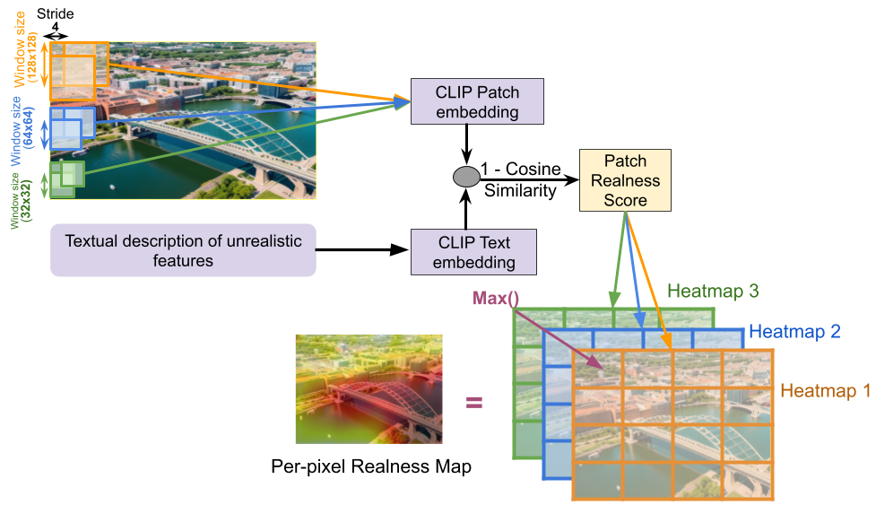

# REALM: REalness Assessment and Localization using Multimodal features

We present **REALM**, a comprehensive framework for analyzing and predicting image realism using multimodal deep learning approaches. This project combines multimodal MOS prediction module (**CORE**) along with a novel approach (**DREAM**) to obtain dense realness mappings to effectively detect unreal patch regions within an image.

## Project Overview

### Objectives:
- **Dataset Augmentation**: We augmented existing AIGI datasets with VLM generated natural language descriptions of visual inconsistencies, extractng relevant textual features
- **Objective Realness Assessment**: We designed *Cross-modal Objective Realness Estimator (CORE)* to use both visual and textual feature to effectively quantify perceptual realism of an image
- **Dense Realness Mapping**: We suggest a novel approach for *Dense REAlness Mapping(DREAM)* for localizing unrealistic regions within an image, with pixel-level interpretability

## Project Structure

```
Realness-Project/
├── datasets/                         # Training and test datasets
│   ├── train/                        # Training data
│   │   ├── images/                   # Training images
│   │   └── image_descriptions.csv    # Training annotations
│   └── test/                         # Test data
│       ├── images/                   # Test images
│       └── image_descriptions.csv    # Test annotations
├── regression/                       # MOS prediction module
│   ├── train.py                      # Training CORE Model
│   ├── inference.py                  # Test CORE Model
│   ├── realism_dataset.py            # Dataset class
│   ├── core.py                       # CORE Model architecture
│   └── outputs/                      # Training outputs
│       ├── best_model.pth            # Best model checkpoint
│       └── training_curves.png       # Training visualization
├── localization/                     # Realness mapping module
│   ├── desc_generation.py            # Image description generation
│   ├── compute_heatmaps.py           # Heatmap computation
│   └── run_dream.py                  # Run complete DREAM pipeline
├── scripts/                          # Shell scripts
│   ├── run_training.sh               # Train CORE
│   ├── run_inference.sh              # Test CORE
│   └── compute_heatmaps.sh           # Run DREAM
├── doc_images/                       # Documentation assets
│   ├── DREAM results.png             # Sample results
│   └── CORE architectre.png          # Architecture diagram
├── config.py                         # Configuration settings
├── utils.py                          # Utility functions
├── pyproject.toml                    # Project dependencies
├── requirements.txt                  # Python dependencies
└── README.md                         # Documentation
```

## How to Use

### Prerequisites

- Python 3.9+
- CUDA-compatible GPU (recommended)
- 8GB+ RAM

### Installation

1. **Clone the repository:**
   ```bash
   git clone <repository-url>
   cd Realness-Project
   ```

2. **Create a virtual environment:**
   ```bash
   python3 -m venv venv
   source venv/bin/activate  # On Windows: venv\Scripts\activate
   ```

3. **Install dependencies:**
   ```bash
   pip install -e .
   ```

### Training CORE

Run the training script to train the multimodal MOS prediction model:

```bash
./train.sh
```

Or run directly:
```bash
python3 -m regression.train
```

### Computing Dense Realness Heatmaps

Compute heatmaps to visualize which parts of images appear unrealistic:

```bash
# Process a single image (default: f22.png)
./compute_heatmaps.sh

# Process specific images
./compute_heatmaps.sh f22.png f126.png

# Process all test images
./compute_heatmaps.sh --all

# Process specific image with custom parameters
./compute_heatmaps.sh f22.png --window 128 --stride 64
```

## CORE (Cross-model Objective Realness Estimator)

Our multimodal approach is a combination of three distinct modules:
- **Visual Feature Extraction Module**: ResNet-50 (pretrained on ImageNet)
  - Extracts 2048-dimensional image features
  - Optional freezing for transfer learning

- **Textual Feature Extraction Module**: BERT-base-uncased (pretrained on Wikipedia and BookCorpus)
  - Processes image descriptions
  - Generates 768-dimensional text embeddings

- **Fully Connected Network Module**: 
  - Concatenates visual and text features 
  - Dense layers with ReLU activation
  - Single output for MOS prediction


## DREAM (Dense REAlness Mapping)

Uses CLIP (Contrastive Language-Image Pre-training) for patch-level analysis:

- **Sliding Window**: Processes image patches with configurable window size and stride
- **Text-Image Similarity**: Computes cosine similarity between patch embeddings and text descriptions
- **Heatmap Generation**: Aggregates similarity scores to create spatial heatmaps



## Performance and Results

### MOS Prediction module (CORE)
The model is evaluated using:
- **Spearman Correlation**: Measures rank correlation with human judgments
- **Pearson Correlation**: Measures linear correlation

|**Dataset**        | **SROCC**  | **PLCC**    |
|-------------------|------------|-------------|
| RAISE             | 0.7778     | 0.7976      |     
| AGIN              | 0.7564     | 0.7711      |  

### Realness Heatmap Computation module (DREAM)
We present the results of our dense realness mapping module in the form of heatmaps


## Dataset Format

### Data Fields
- **filename**: Image filename (PNG format)
- **MOS**: Mean Opinion Score (continuous value, higher = more realistic)
- **description**: Detailed text description of realism assessment

## Configuration

### Environment Variables

Set in `config.py`:
```python
BASE_DIR = Path(os.getenv("PROJECT_ROOT", Path(__file__).resolve().parent))
```

### Key Parameters

- **Image Size**: 384 × 512 pixels
- **Text Length**: Maximum 128 tokens
- **Batch Size**: 16 (adjustable)
- **Learning Rate**: 0.0001 (default)

## Requirements

Core dependencies:
- `torch` >= 1.12.0
- `torchvision` >= 0.13.0
- `transformers` >= 4.20.0
- `pandas` >= 1.4.0
- `PIL` (Pillow)
- `matplotlib`
- `scikit-learn`
- `scipy`
- `numpy`


## Citation

If you use this project in your research, please cite:

```bibtex
@misc{
}
```

## Authors

- **Dr. Somdyuti Paul** - somdyuti@cai.iitkgp.ac.in
- **Lovish Kaushik** - lovishkaushik.24@kgpian.iitkgp.ac.in  
- **Agnij Biswas** - biswasagnij@kgpian.iitkgp.ac.in

## License


## Acknowledgments


